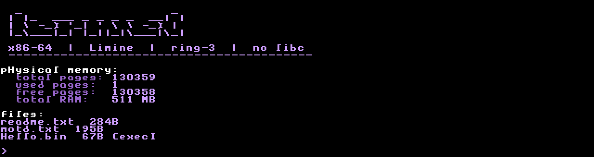

# Kernel

## Overview

This project involves developing a custom operating system (OS) that includes a bootloader and a kernel. The OS is written in Assembly and C and is intended to run on both real hardware and virtual machines. The project features a basic bootloader using GRUB, a kernel entry point, and kernel code with a simple print function for demonstration purposes.


## Building & Setup

To build and set up the project, run the `setup.sh` script. Ensure that you replace `x.y.z` with your specific version.

If you encounter any errors, refer to the `setup_commands.md` file for troubleshooting and additional setup commands.

## Running

To run the OS in a virtual environment, simply execute:

```bash
make all & make run
```

## Burning into Flash

1. Identify the address of your flash drive (e.g., `/dev/sdX`).
2. Use the `prepare_flash.sh` script with two command-line parameters:

    ```bash
    sudo ./scripts/prepare_flash.sh OS.bin /dev/sdX
    ```

3. Once the OS is burned onto the flash drive, you can boot it on real hardware.

---

