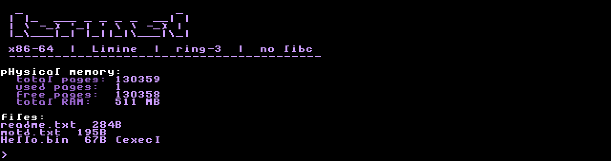

```
  _                    _
 | |_  ___ _ _ _ _  __| |
 | / -_) '_| ' \ / -_) |
 |_\___|_| |_||_|\___\_|

 x86-64  |  Limine  |  ring-3  |  no libc
```

A 64-bit x86 kernel written from scratch in C and Assembly. Boots via Limine into higher half, brings up its own memory management, scheduler, syscall interface, and a RAM-backed filesystem — then drops into an interactive shell.

No libc. No shortcuts.

---

## What's running

```
┌─────────────────────────────────────────┐
│  User Programs (Ring 3)                 │
├─────────────────────────────────────────┤
│  Syscall Interface  (int 0x80)          │
├─────────────────────────────────────────┤
│  Process Manager  │  RAM Filesystem     │
├───────────────────┼─────────────────────┤
│  Scheduler (PIT)  │  Shell              │
├───────────────────┴─────────────────────┤
│  Virtual Memory Manager (VMM)           │
├─────────────────────────────────────────┤
│  Physical Memory Manager (PMM)          │
├─────────────────────────────────────────┤
│  GDT/TSS │ IDT/PIC │ Keyboard │ Timer  │
├─────────────────────────────────────────┤
│  Limine Bootloader                      │
└─────────────────────────────────────────┘
```

- **Bootloader** — Limine v8, higher half kernel at `0xffffffff80000000`
- **GDT + TSS** — flat 64-bit segments, kernel/user, TSS rsp0 per-process
- **IDT + PIC** — 256 vectors, remapped IRQs, installable IRQ handlers
- **PMM** — bitmap allocator over Limine memmap, 4KB page granularity
- **VMM** — 4-level page tables (PML4→PDPT→PD→PT), own CR3, identity + higher-half map
- **PIT Timer** — 1kHz IRQ0, tick counter, preemption foundation
- **Process Manager** — PCB, round-robin scheduler, ring 3 transition, context switch in asm
- **Syscall** — `int 0x80` DPL=3 gate, dispatch table (`write`, `exit`, `getpid`)
- **RAM Filesystem** — flat in-memory FS, built-in test binaries
- **Shell** — `ls`, `cat`, `exec`, `meminfo`, `ps`, keyboard-driven

---

## Boot



---

## Build & run

```bash
make all && make run
```

Requires: `gcc`, `nasm`, `ld`, `xorriso`, `qemu-system-x86_64`

## Flash to hardware

```bash
./flash.sh
sudo ./prepare_flash.sh image.hdd /dev/sdX
```
